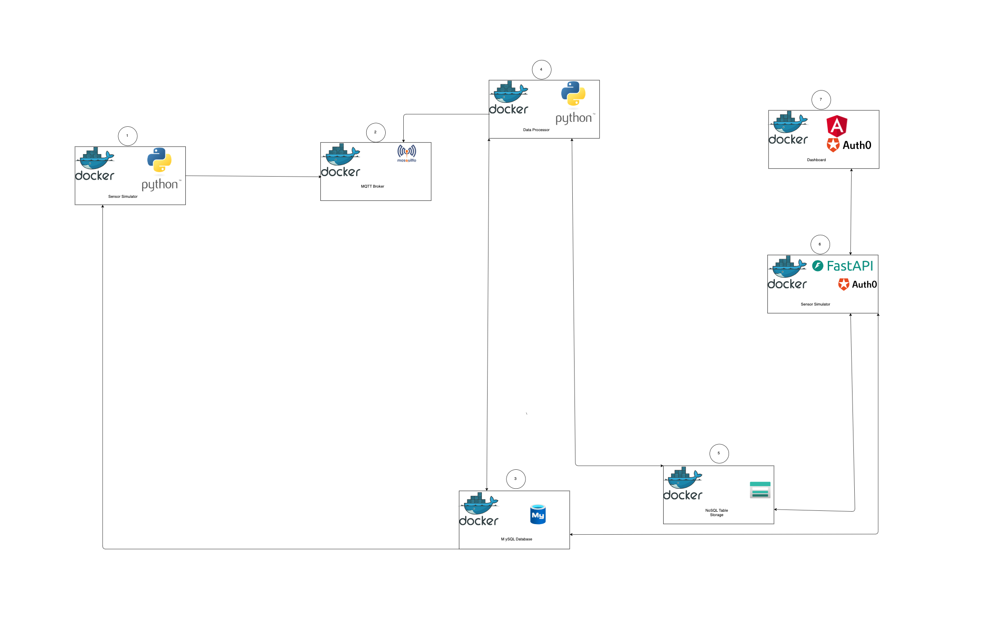

## Running the Application with Docker

### step 1: Clone the Repository and Navigate to the Project Directory

1. Clone the repository using the following command: `git clone https://github.com/ManassehV2/SE4IoT-FarmAdvisor-Simplified.git`

2. Navigate to the project directory: `cd SE4IoT-FarmAdvisor-Simplified`

### step 2: Setup Environment Variables

Before running the project, you need to set up the environment variables. This is done by creating a `.env` file in the root directory of this project.

### Steps to Create `.env` File

1. In the root directory of the project, create a file named `.env`.
2. Add the following content to the `.env` file:

   ```env
   DB_HOST=mysql_db
   DB_PORT=3306
   DB_NAME=farmadvisor
   DB_USER=root
   DB_PASSWORD=password01
   STORAGE_SERVICE="DefaultEndpointsProtocol=http;AccountName=devstoreaccount1;AccountKey=Eby8vdM02xNOcqFlqUwJPLlmEtlCDXJ1OUzFT50uSRZ6IFsuFq2UVErCz4I6tq/K1SZFPTOtr/KBHBeksoGMGw==;TableEndpoint=http://azurite:10002/devstoreaccount1;"
   AZURITE_TABLE_PORT=10002
   MQTT_BROKER="mosquitto"
   MQTT_PORT=1883
   MQTT_TOPIC_PREFIX="farms"
   AUTH0_DOMAIN=dev-7q1hcma4yuzy68dc.us.auth0.com
   AUTH0_CLIENT_ID=lzEduAYKdEE4UH2IQudBZwBgfc8MhQvi
   AUTH0_AUDIENCE=http://localhost:8000
   BASE_WEATHER_API_URL=https://api.met.no/weatherapi/locationforecast/2.0
   GET_FORECAST_INTERVAL_SEC=120
   DATA_GENERATION_INTERVAL_SEC=60
   ```

3. Save the file.
### Step 4: Build and Run the Containers

Use Docker Compose to build and run all the services defiend in the `docker-compose.yml`.

`docker compose up --build`

### Step 5: Accessing the Application and Services

1. **API Service**:

   - The backend API is available at `http://localhost:8000`.
   - Swagger documentation for the API is available at `http://localhost:8000/docs`.

2. **Angular Dashboard**:
   - Access the front-end application at `http://localhost:8080`.

### Step 6: Stopping the Containers

To stop the running containers, use:

`docker compose down`

## System Architecture

Below is the system architecture of the application:


